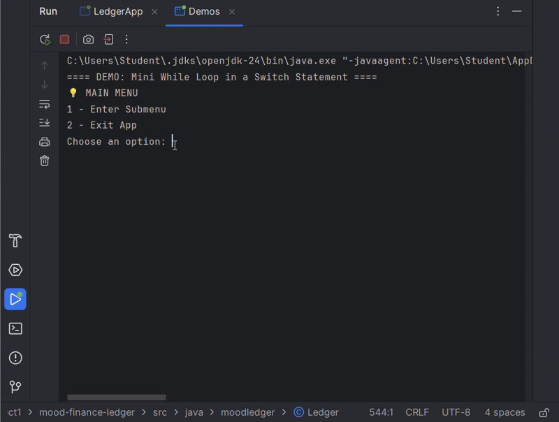

# Mood Finance Ledger

## 📘 Description

Mood Finance Ledger is a simple Java CLI app designed to help you track where your money goes — and what it means to you. It lets you record deposits, log payments, and generate clear reports, all saved in a tidy .csv file with the newest entries first.

Inspired by the heart of a mental health app that I am working on, this tool isn’t just about finances — it’s about noticing patterns, building awareness, and staying grounded while you grow.

---

## 🛠️ Features

- 🏠 **Home Screen**
  - 1) Add Deposit
  - 2) Make Payment (Debit)
  - 3) Ledger
  - 4) Exit

- 📓 **Ledger Menu**
  - A) All Entries
  - D) Deposits Only
  - P) Payments Only
  - R) Reports
  - H) Return to Home

- 📊 **Reports Menu**
  - 1) Month to Date
  - 2) Previous Month
  - 3) Year to Date
  - 4) Previous Year
  - 5) Search by Vendor
  - 6) Custom Search
  - 0) Return to Ledger

- 🔍 **Custom Search**:
  - Start Date
  - End Date
  - Description
  - Vendor
  - Amount


---

### 🎥 Custom Search Demo


```

## 🚀 How to Run

### Prerequisites
- IntelliJ IDEA 

### Setup Steps

1. Clone the repository:
```bash
git clone https://github.com/Fspike1/mood-finance-ledger.git
```

2. Open the project in your IDE  
3. Navigate to `LedgerApp.java` and run the program  
4. Make sure the file `MoodLedgerTransactions.csv` is in the same folder as your `src` or `bin` directory

---

## 💡 Interesting Code Snippet: `Demos.java`

This demo shows how a while loop inside a switch statement can be used to create a smooth, menu-based experience.




---

## 🧠 What I Learned

- File I/O using Java's `BufferedReader` and `FileWriter`
- Working with CSV data and preventing formatting crashes
- Using `LocalDate` and `.isBefore()` / `.isAfter()` for date comparison
- Building multi-screen CLI apps using loops and switch cases
- Handling user input carefully with `Scanner` and `.nextLine()`

---

## 🧱 Project Structure

```text
├── src
│   └── moodledger
│       ├── LedgerApp.java
│       ├── Ledger.java
│       └── Transactions.java
├── MoodLedgerTransactions.csv
```

---

## 📌 GitHub Requirements

- ✅ Public GitHub repo  
- ✅ Meaningful commit history  
- ✅ Informative README  
- ✅ Code structure with CSV support

---

## 👩🏽‍🏫 Project Demo Checklist

- [x] Run through home, ledger, and report screens
- [x] Demonstrate a custom search
- [x] Show code in `customSearch()`
- [] Answer any Q&A from the audience

---

## 📃 License (optional)
This project is for educational purposes as part of the Pluralsight Java Academy in the YearUp program.
> ✅ README updated by Faith on May 1st!
