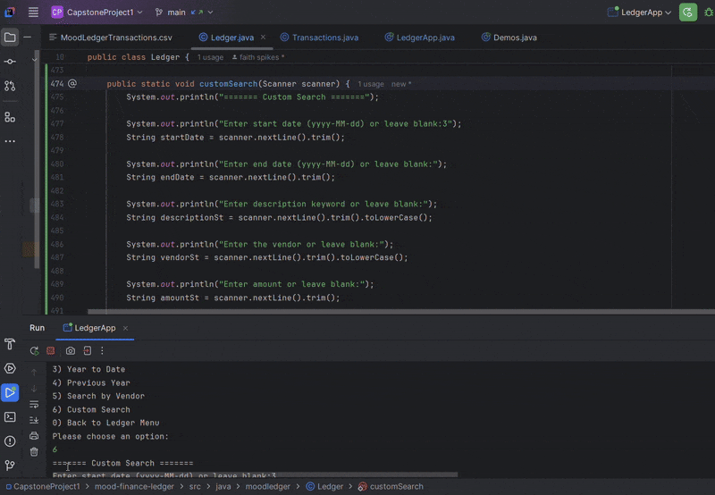

# Mood Finance Ledger

## 📘 Description

Mood Finance Ledger is a Java CLI application designed to help users track financial transactions for personal or business use. It allows users to record deposits and payments, view and filter ledger entries, and generate reports. Transactions are saved in a `.csv` file and displayed with the newest entries first.

---

## 🛠️ Features

- 🏠 **Home Menu**
  - 1) Add Deposit
  - 2) Make Payment (Debit)
  - 3) Ledger
  - 4) Exit

- 📓 **Ledger Menu**
  - A) All Entries
  - D) Deposits Only
  - P) Payments Only
  - R) Reports
  - H) Return to Home

- 📊 **Reports Menu**
  - 1) Month to Date
  - 2) Previous Month
  - 3) Year to Date
  - 4) Previous Year
  - 5) Search by Vendor
  - 6) Custom Search
  - 0) Return to Ledger

- 🔍 **Custom Search**:
  - Start Date
  - End Date
  - Description
  - Vendor
  - Amount

> Fields left blank will be ignored. Matching entries are filtered accordingly.

---

### 🏠 Home Screen

```
================================
 MOOD LEDGER HOME SCREEN 
=================================
1- Add Deposit
2- Make Payment
3- Go to Ledger
4- Exit
```

### 🎥 Custom Search Demo

```



```

## 🚀 How to Run

### Prerequisites
- Java 17 or higher
- IntelliJ IDEA (or another IDE)

### Setup Steps

1. Clone the repository:
```bash
git clone https://github.com/Fspike1/mood-finance-ledger.git
```

2. Open the project in your IDE  
3. Navigate to `LedgerApp.java` and run the program  
4. Make sure the file `MoodLedgerTransactions.csv` is in the same folder as your `src` or `bin` directory

---

## 💡 Interesting Code Snippet: `customSearch()`

[View the customSearch method in GitHub ›](https://github.com/Fspike1/mood-finance-ledger/blob/main/src/java/moodledger/Ledger.java#L474)


```java
if (start != null && entryDate.isBefore(start)) {
    matches = false;
}
if (vendor != null && !vendor.toLowerCase().contains(vendorSt)) {
    matches = false;
}
```

This method filters data based on user inputs. If the user leaves a field blank, that filter is skipped. It uses `LocalDate` to handle dates and checks multiple conditions in one clean loop.

---

## 🧠 What I Learned

- File I/O using Java's `BufferedReader` and `FileWriter`
- Working with CSV data and preventing formatting crashes
- Using `LocalDate` and `.isBefore()` / `.isAfter()` for date comparison
- Building multi-screen CLI apps using loops and switch cases
- Handling user input carefully with `Scanner` and `.nextLine()`

---

## 🧱 Project Structure

```text
├── src
│   └── moodledger
│       ├── LedgerApp.java
│       ├── Ledger.java
│       └── Transactions.java
├── MoodLedgerTransactions.csv
```

---

## 📌 GitHub Requirements

- ✅ Public GitHub repo  
- ✅ Meaningful commit history  
- ✅ Informative README  
- ✅ Code structure with CSV support

---

## 👩🏽‍🏫 Project Demo Checklist

- [] Run through home, ledger, and report screens
- [] Demonstrate a custom search
- [] Show code in `customSearch()`
- [] Answer any Q&A from the audience

---

## 📃 License (optional)
This project is for educational purposes as part of the Pluralsight Java Academy.
> ✅ README updated by Faith on May 1st!
